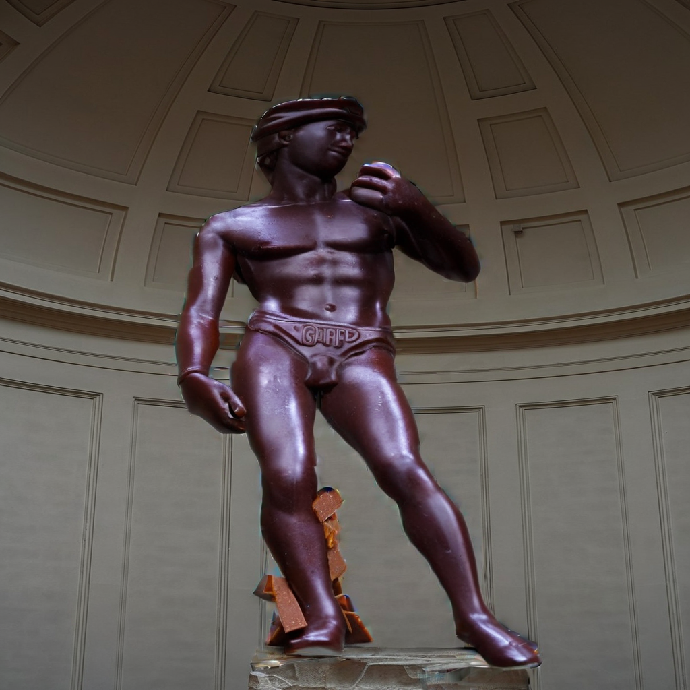

# zeST_docker
ZeST docker


# ZeST docker

Dockerization of the [Hugging Face ZeST Space](https://huggingface.co/spaces/fffiloni/ZeST)

To make the Michelangelo's David


like chocolate



 * Space: [fffiloni/ZeST](https://huggingface.co/spaces/fffiloni/ZeST)

## Requisites

[Docker](https://docs.docker.com/desktop/) and [nvidia container toolkit](https://docs.nvidia.com/datacenter/cloud-native/container-toolkit/latest/install-guide.html) must be installed.

## Usage

### Downloads checkpoints

Download [checkpoints](https://modelscope.cn/models/yutong/Ranni/files) into `docker/models` fo

### Create Hugging Face token

You have to request to access the model from the [Meta llama 7B](https://huggingface.co/meta-llama/Llama-2-7b-chat-hf). When you have access, you nedd to create a [Hugging Face token](https://huggingface.co/settings/tokens) and writo into `docker/huggingface/token`

### Download the image from the Docker Hub

You can download the image and run it

```bash
docker pull maximofn/face_to_all:latest
./run_app.sh
```

### Build the image

Or you can build the image and run it

```bash
./build_docker_image.sh
./run_app.sh
```