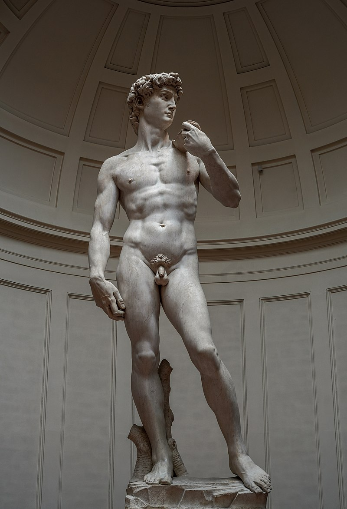

# ZeST docker

Dockerization of the [Hugging Face ZeST Space](https://huggingface.co/spaces/fffiloni/ZeST)

To make the Michelangelo's David



like chocolate


 * Space: [fffiloni/ZeST](https://huggingface.co/spaces/fffiloni/ZeST)

## Requisites

[Docker](https://docs.docker.com/desktop/) and [nvidia container toolkit](https://docs.nvidia.com/datacenter/cloud-native/container-toolkit/latest/install-guide.html) must be installed.

## Usage

### Download the image from the Docker Hub

You can download the image and run it

```bash
docker pull maximofn/zest:latest
./run_app.sh
```

### Build the image

Or you can build the image and run it

```bash
./build_docker_image.sh
./run_app.sh
```